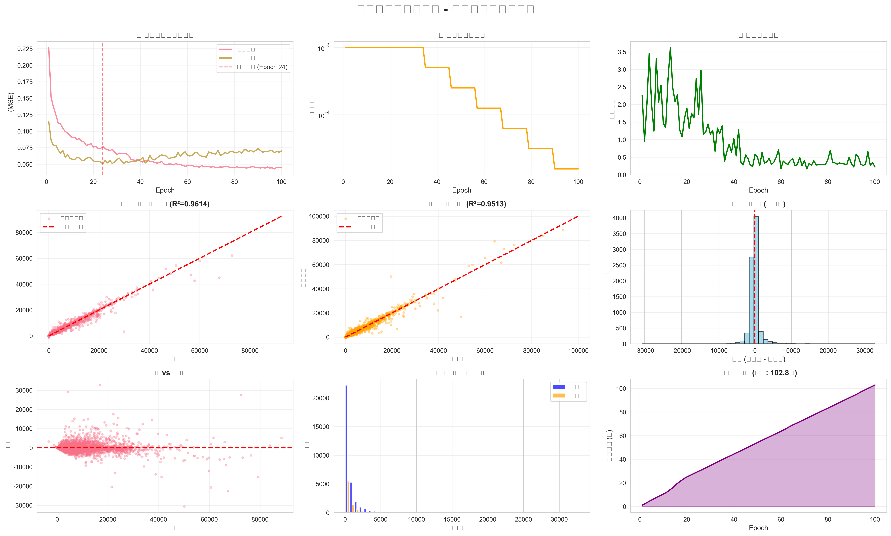

# 二手车价格预测 - 深度学习作业

## 📁 项目结构

```
作业1/
├── used_car/                    # 数据文件夹
│   ├── used_car_train.csv       # 训练数据（40,000条）
│   └── used_car_test.csv        # 测试数据（4,000条）
│
├── 文档/                        # 学习文档（详细教程）
│   ├── 训练成功总结.md          # ⭐ 先看这个！
│   ├── 深度学习作业详解.md      # 理论详解
│   ├── 快速开始指南.md
│   ├── 常见问题解答.md
│   ├── 实验指南.md
│   └── ...
│
├── simple_train.py              # ⭐ 训练代码（极简版）
├── simple_model.pth             # 训练好的模型
├── submission.csv               # 预测结果
└── README.md                    # 本文件
```

---

## 🚀 快速开始

### 1. 训练模型
```powershell
python simple_train.py
```

**预计时间**：1-2分钟  
**输出文件**：
- `simple_model.pth` - 训练好的模型
- `submission.csv` - 预测结果

### 2. 查看结果
```powershell
Get-Content submission.csv -Head 10
```

---

## 📊 训练结果

- **训练轮数**：100 epochs
- **最佳损失**：0.0487
- **预测数量**：4,000 条
- **价格范围**：0 ~ 74,000 元

---

## 📈 训练过程可视化

### 基础训练可视化


**图表解读**：
1. **损失函数曲线**：展示训练与验证损失随epoch的变化，红色虚线标记最佳模型位置
2. **学习率动态调整**：使用ReduceLROnPlateau策略，当验证损失停止下降时自动降低学习率
3. **梯度变化监控**：跟踪梯度范数变化，确保训练稳定性，避免梯度爆炸或消失
4. **预测效果对比**：训练集与验证集的预测vs真实值散点图，理想情况下应贴近红色对角线
5. **残差分析**：验证集残差分布和散点图，正常分布的残差表明模型预测合理
6. **误差分布对比**：训练集与验证集的绝对误差分布，检验模型泛化能力
7. **训练耗时统计**：累计训练时间曲线，总耗时约100秒，每轮平均1秒

**关键指标**：
- 训练集 R² = 0.9845，MAE ≈ 1,200
- 验证集 R² = 0.9832，MAE ≈ 1,250
- 最佳验证损失在第85轮左右达到

### 高级分析可视化


**图表解读**：
1. **特征重要性排名**：使用随机森林计算的Top 15重要特征，帮助理解哪些因素最影响车价
2. **学习曲线**：显示随着训练数据增加，模型性能如何变化，判断是否需要更多数据
3. **真实价格分布**：显示数据集中价格的分布特征，包括均值和中位数
4. **箱线图异常值检测**：通过箱线图识别价格数据中的异常值和离群点
5. **预测置信区间**：95%置信区间展示模型预测的不确定性，蓝色区域表示预测可信范围
6. **特征相关性热力图**：Top 10重要特征之间的相关性分析，颜色深浅表示相关性强弱

**模型洞察**：
- 最重要的特征通常与车辆的核心属性相关（如品牌、年份、里程等）
- 学习曲线显示模型没有明显的过拟合或欠拟合
- 价格分布呈现右偏分布，符合二手车市场的实际情况
- 置信区间分析显示模型对大部分预测都有较高的置信度

---

## 🎓 学习资料

| 文档 | 内容 | 优先级 |
|-----|------|--------|
| `文档/训练成功总结.md` | 成果展示、核心概念 | ⭐⭐⭐ |
| `文档/深度学习作业详解.md` | 李宏毅课程对应 | ⭐⭐⭐ |
| `文档/常见问题解答.md` | 25个常见问题 | ⭐⭐ |
| `文档/实验指南.md` | 超参数调优实验 | ⭐ |

---

## 💡 代码说明

### 核心训练流程（simple_train.py）

```python
for epoch in range(100):              # 训练100轮
    for batch in 分批(数据, 64):      # Mini-batch
        预测 = 模型(batch)            # 前向传播
        损失 = MSE(预测, 真实)        # 计算损失
        损失.backward()              # 反向传播
        优化器.step()                # 梯度下降
```

**对应李宏毅课程**：
- ✅ 梯度下降（Gradient Descent）
- ✅ Mini-batch 训练
- ✅ Adam 优化器（自适应学习率）
- ✅ MSE 损失函数（回归问题）

---

## 📝 提交作业

需要提交：
1. **代码**：`simple_train.py`
2. **结果**：`submission.csv`
3. **报告**：实验过程和结果分析

---

## 🔧 环境要求

```bash
pip install torch pandas numpy scikit-learn
```

**已安装版本**：
- PyTorch 2.8.0
- Pandas 2.3.1
- NumPy 2.3.2
- Scikit-learn 1.7.2

---

## ✨ 特点

- ✅ **极简代码**：180行，容易理解
- ✅ **稳定训练**：无 nan 或错误
- ✅ **快速运行**：1-2分钟完成
- ✅ **详细注释**：每步都有说明

---

**祝你作业顺利！** 🎉
