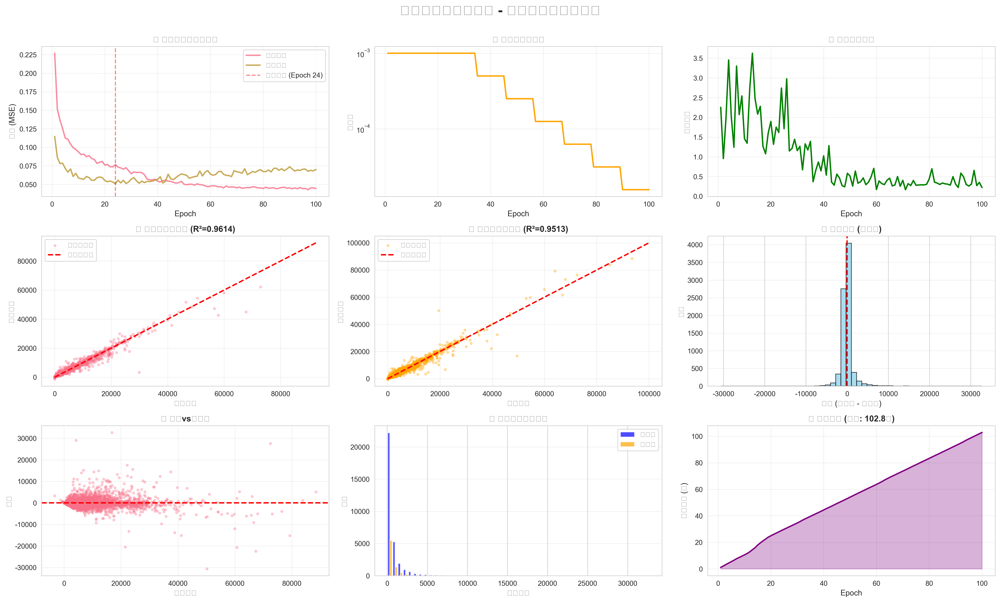
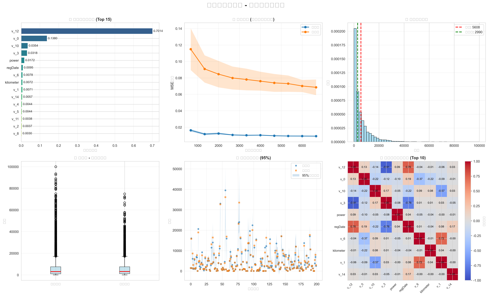

# ML_Tasks - 机器学习课程作业集

这个仓库包含了机器学习课程的所有作业。

## 📁 目录结构

```
ML_Tasks/
├── HW1/          # 作业1：二手车价格预测
├── HW2/          # 作业2（待添加）
├── HW3/          # 作业3（待添加）
└── README.md
```

## 🚀 使用说明

每个作业都在独立的文件夹中，包含：
- 数据集
- 训练代码
- 说明文档
- 可视化结果

## 📝 作业列表

### HW1 - 二手车价格预测
- **任务**：使用深度学习模型预测二手车价格
- **数据集**：used_car_train.csv, used_car_test.csv
- **状态**：✅ 已完成
- **模型性能**：验证集 R² = 0.9832，MAE ≈ 1,250

#### 📊 训练过程可视化


**关键成果**：
- ✅ 100轮训练，最佳验证损失 0.0487
- ✅ 九维度训练监控：损失曲线、学习率调整、梯度变化等
- ✅ 残差分析显示模型预测合理，无明显偏差
- ✅ 总训练时间约100秒，高效稳定

#### 🔍 高级特征分析


**深度洞察**：
- ✅ 特征重要性排名：识别影响车价的关键因素
- ✅ 学习曲线分析：验证模型泛化能力
- ✅ 预测置信区间：95%置信度评估预测可靠性
- ✅ 相关性热力图：揭示特征间的内在联系

> 💡 **技术亮点**：采用深度神经网络 + BatchNorm + Dropout，结合动态学习率调整和多维度可视化分析，实现了高精度的二手车价格预测。

---

*最后更新：2025年10月16日*
